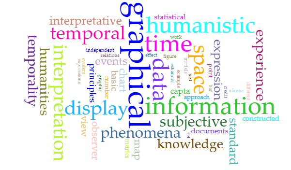
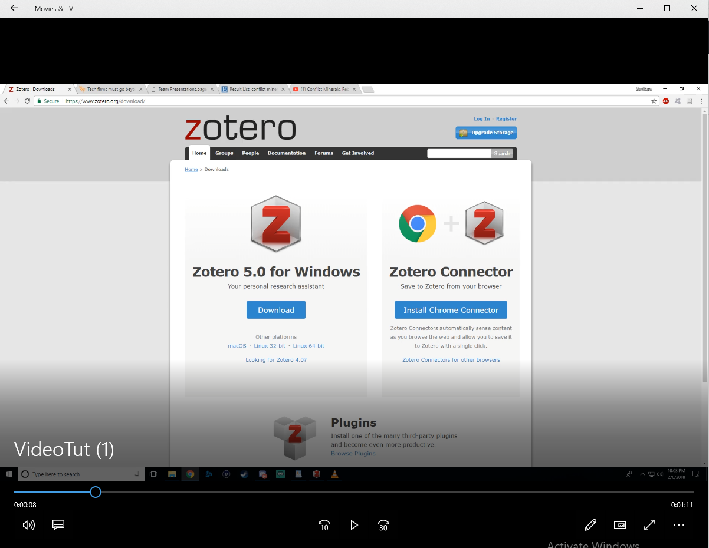

# IASC 2P02 | Santiago Montoya 

## Bio

I am a second-year student currently enrolled in the Interactive Arts and Science program at brock University. During my time attending in the 2P02 course I found that the research areas that I decided to work with are open access publishing and data visualization. The data visualization research area is directly reflected in my blog post where I decided to use voyant tools to create a visual representation of words that are consistently used giving the reader an idea of what the Duckers work will be focusing on.  For the group project my team and I decided to work with Zotero a free open-source reference manager. For my portion on the project I got the chance to create a short video and images to give a small tutorial on how to use the program, this directly reflects open access publishing as well as data visualization. I am always learning of new open access software’s and websites, which is why I wish to keep working with them for maybe one day I can direct my peers to helpful tools for a specific academic utility. Representing data visually has always interested me due to there being no boundaries on how this could be accomplished, I hope to find new and creative ways of representing data outputs in my future work. 

## Featured Project: [Blog Post]

For my featured project I decided to showcase and rework/improve on my blog post assignment. The following blog post project touches on Drucker and Ramsays work touching on data and capta, their differences, and then followed by two visual representations of these terms using voyant-tools.  I argued that in my blog post that as an individual living a technological society being familiar with these terms can greatly benefit the modern person do get an idea of what the purpose of this information will be used for and if there is an already biased decision being made for you without your knowledge. The reason I decided to showcase this project was its direct relation to one of my research areas of interest ‘data visualization’. I chose to use the voyant-tools to show the meaning of capta and explain how an individuals’ ideologies can influence a different combination of words differ to my chosen combination. To represent data, I used a Cirrus which chose re-occurring words in Duckers work then bolded and expanded the more common words in the text. This already given makes it data since the user/viewer can’t do anything to directly influence the outcome of the information being given. 

Looking back at this project it research and finding are as concrete as they were when I first encountered them. Examples of data and capta can be seen in a daily occasion from multiple different sources, either it being rankings of teams of the NHL on the internet, or an optional paper survey that one can take for a gift card at your favorite café. When I decided to revise my blog project I decided that small grammar errors were not acceptable, so I took the extra time to check over my grammar and re-arrange any awkward sentences which you can see in the following commit [here](https://github.com/sm16ut/IASC-2P02/commit/57baf2e1a96cba37514697d9b7e5879c9055b70a)
I also decided to add a few extra sentences to make my post more argumentative as well as giving it a more solid foundation on the topic of data and capta. The changes can be seen in the following commit. [here](https://github.com/sm16ut/IASC-2P02/commit/57baf2e1a96cba37514697d9b7e5879c9055b70a)
Finally for my last modification I decided that my blog post could benefit with an extra paragraph outlining the benefits of understanding what the information you are giving or taking in is being used for as well as being able to differentiate an unbiased survey from a biased one.  The changes can be seen in the following commit posted [here](https://github.com/sm16ut/IASC-2P02/commit/97facec35930a2ef7526b3eaa57a8f4753aa18fb)
Revisiting this project gave me new ideas on how I might been able to display this data in none traditional ways, I look forwards on being able to visually display this type of data in future projects. 

## Collaborative Project

While working on the assigned group project, me and my team decided to do our presentation on the free open-source reference manager ‘Zotero’. I got given the task on creating a simple tutorial for people interested in the application by using a collection of images as well a video that I voiced over during the presentation. Zotero having so many utilities made it difficult for me to give a comprehensive tutorial in less than 5 minutes, due to this I decided to focus and explain on Zoteros focus and keep it short and comprehensive.  

The portion of the presentation I got assigned did not require too much of my team members attention. From the first date that we got the assignment I made sure to communicate to my group my idea for a tutorial utilizing images and video. My group and I discussed possible ways of delivering this task and we decided I would use a live voice over a prerecorded and images showing helpful tools to note in the Zotero app. Between the date that this presentation was assigned and the date that it was due, I had to communicate with my group briefly via Facebook group chat. There we would discuss who needed assistance, if there was any portion that needed being done to complete another, and decisions on the overall structure of the final presentation. I believe the method decided for showcasing the Zotero application was more than adequate, doing a real-time voice over gave me the advantage on focusing on what my team and I agreed was important information to share. Once every group member had finished their assigned portion of the presentation, we all decided on meeting up to put our parts together. In this time, we we’re all able to express our opinions on each other’s work and make changes if needed. Overall, I think this group project went well with every team member fulfilling their task and collaborating on creating a final presentation we could all be proud of. 

Here is an image of the video tutorial I created. As one can see it shows all Zoteros interface as well as how to find certain citations or bookmarks you have made.
### Commits

[Image #1](https://github.com/IascAtBrock/IASC-2P02-TeamPresentations/commit/be5bed75e12f38e92dd72b17980db1abc82240db)
[Image #2](https://github.com/IascAtBrock/IASC-2P02-TeamPresentations/commit/da4dc9d8df1abb16d459883d4a367025dd32ddca)

## Research Presentation

[Team Presentiation](https://github.com/IascAtBrock/IASC-2P02-TeamPresentations/tree/Team5)

## Academic Blog

[Santiagos Blog Post](https://github.com/sm16ut/IASC-2P02/blob/master/blog.md)
